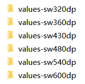

# AndroidDimens

这是一个用于解决Android开发中屏幕适配问题的库。

## 原理

Google官方建议我们使用dp来做长度单位，dp又称dip，翻译过来是“设备独立像素”，就是为了解决对像素的依赖而诞生的。

根据[官方](https://developer.android.com/guide/practices/screens_support.html)的描述：

- 超大屏幕至少为 960dp x 720dp
- 大屏幕至少为 640dp x 480dp
- 正常屏幕至少为 470dp x 320dp
- 小屏幕至少为 426dp x 320dp

那么同样为160dp x 160dp的控件在这些屏幕上看起来大小就显得不一致，不仅如此，由于Android的碎片化问题，市场上还有很多屏幕宽度为360dp、540dp、600dp等的手机，这些还不算Pad、TV和Ware。

如果你们团队的UI人手够多或者足够耐心，能够给你按照不同屏幕分别标注出来，那么你可以通过将每个控件的尺寸定义到dimen.xml并分别放到values-hdpi、values-xhdpi、values-xxhdpi、values-xxxhdpi文件夹中来解决这个问题，否则你必须以一套标注为基准，自己算出其他的值。

假如你们的UI使用的是iPhone，那么恭喜你，你还要懂得如何把px转换为dp。

这个库的作用就是为了解决这个问题，能够根据不同大小的屏幕自动生成对应的dimen值。假设UI是以iPhone6作为基准进行标注，而iPhone6的屏幕参数为：

- 分辨率 1334 x 750 (px)
- 对角线长度 4.7 (inch)
- ppi或dpi 326

对于屏幕最小边长度为320dp的手机，标注的1px对应320 / 750 = 0.427 dp，其他屏幕同理，生成的dimen值如下：

```xml
<?xml version="1.0" encoding="utf-8"?>
<resources>
    <dimen name="px1">0.42666668dp</dimen>
    <dimen name="px2">0.85333335dp</dimen>
    <dimen name="px3">1.28dp</dimen>
    <dimen name="px4">1.7066667dp</dimen>
    <dimen name="px5">2.1333334dp</dimen>
    ......
</resources>
```

这样在就可以愉快的按照标注的px值写代码啦。

生成的文件夹如下：



其中sw表示屏幕的最小边长度，这种命名表示只要屏幕的最小边长度超过这个值，那么就使用该文件夹下的dimen进行适配，这样就不用考虑手机是横屏还是竖屏的问题了。

> 注意：网上有的解决方案是使用形如values-1920x1080的文件夹进行适配，这并不在官方建议的范围内，实际使用中也是有问题的，会出现适配错误的情况，即找不到或使用错误的dimen值。

## 用法

### Java Code

```java
public class Main {
    
    public static void main(String[] args) {
        String targetDir = "/dimen_root"; // 生成dimen文件的路径
        int baseScreenWidthPx = 750; // UI设计图的屏幕宽度（像素）
        int baseScrrenHeightPx = 1334; // UI设计图的屏幕高度（像素）
        DimenGenerator dimenGenerator = new DimenGenerator(targetDir, baseScreenWidthPx, baseScrrenHeightPx);
        // 需要适配的屏幕宽度（dp）
        ArrayList<Integer> screenWidthDipList = new ArrayList<>();
        screenWidthDipList.add(160);
        screenWidthDipList.add(240);
        screenWidthDipList.add(320);
        screenWidthDipList.add(360);
        screenWidthDipList.add(430);
        screenWidthDipList.add(480);
        screenWidthDipList.add(540);
        screenWidthDipList.add(600);
        dimenGenerator.execute(screenWidthDipList);
    }

}
```

### Command Line

`java -jar AndroidDimens.jar -b 1920,1080 -o E:\dimen_values -s 320,360,480`

可以使用 `java -jar AndroidDimens.jar -h|-?` 查看帮助

## JAR包下载

[AndroidDimens.jar](./jar/AndroidDimens.jar)